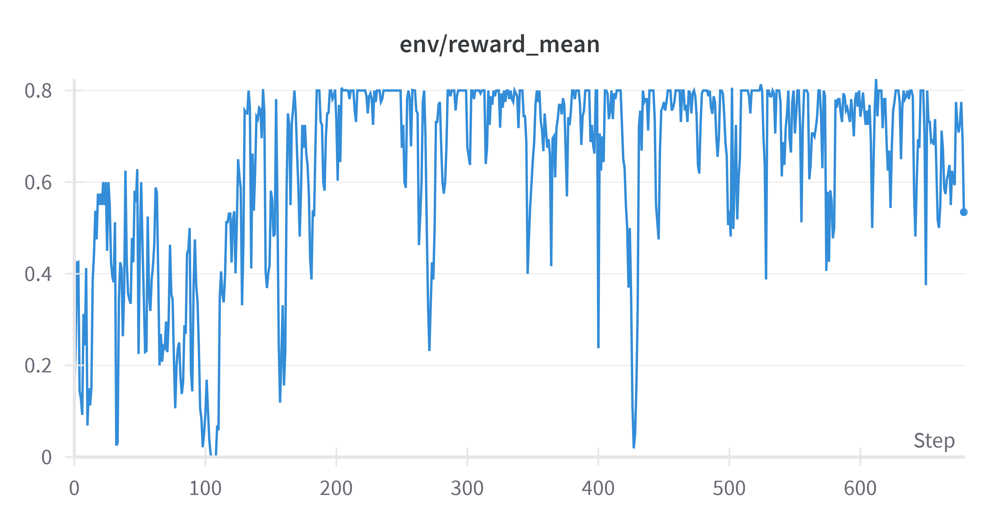
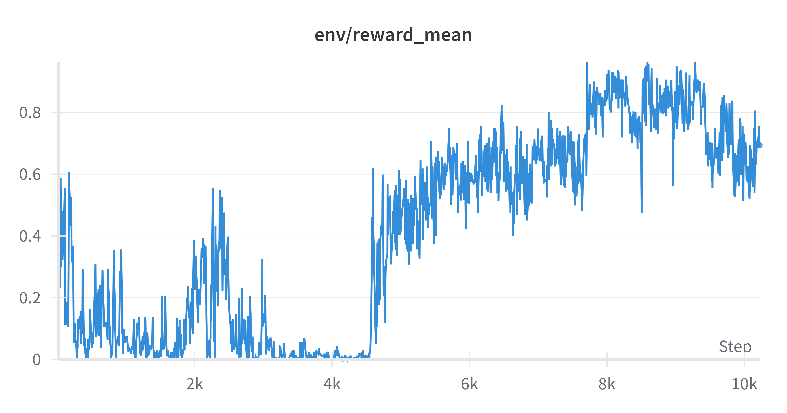

In this example, I am generating synthetic data that conforms to a numerical sequence, and then using SFT + RLAIF to fine-tune an LLM to generate sequences that match the synthetic data.
Specifically, I'll show examples to generate data and tune models for digits that are increasing multiples of 2.
However, the example is intended to be general should you wish to use a custom dataset.

## Contents

* [Run](#Run)
  * [Generating Data](#Generating-Data)
  * [Supervised Fine-tuning (SFT)](#Supervised-Fine-tuning)
  * [Learning a Reward Model](#Learning-a-Reward-Model)
  * [Fusing](#Fuse-and-Upload)
  * [Reinforcement Learning (RLHF)](#Reinforcement-Learning-RLHF)
* [Results](#Results)
* [Custom Data](#Custom-Data)


## Run

The main scripts are `sft.py` and `ppo_training.py`. 
See below for usage on supervised fine-tuning, learning
a reward model, and using RL to further tune a model.

Throughout this example, I have pushed up two example models for SFT or RLHF -- [increasing digit fine-tune](https://huggingface.co/andrewsilva/increasing_digit_fine_tune) and [increasing even-digit fine-tune](https://huggingface.co/andrewsilva/increasing_even_digit_fine_tune). The digit fine-tunes are useful for using the ground-truth sequence scoring function I've included.

### Generating Data
For the running example in this repo, we are using
synthetic data that generates a series of numerical digits.
The hard-coded example I'm working with here is 
increasing multiples of 2 (e.g., "2, 8, 30, 34, 100, ...").

To generate this data, I navigate to the `data` directory and run:
```
python generate_digit_data.py --increasing --multiple-of 2 --num-samples 150 --noise 0.0
```
This data will have _no_ noise (all sequences are perfect), between 5-15 numbers per sequence.

For reward learning, I add a bit of noise (because sequences must have different levels of "reward").

The options for this script are:
* `--num-samples` -- How many samples should we generate? Defaults to 100.
* `--min-length` -- Minimum sequence length. Defaults to 5.
* `--max-length` -- Maximum sequence length. Defaults to 15.
* `--noise` -- Amount of noise to add to each sequence. Defaults to 0.2.
* `--increasing` -- Should sequences be increasing numbers?
* `--decreasing` -- Should sequences be decreasing numbers?
* `--multiple-of` -- What number should all digits be a multiple of? Defaults to 1 (any number is valid).

### Supervised Fine-tuning

To fine-tune a model use:

```
python sft.py --model <path_to_model> \
               --train \
               --iters 600 \
               --data-base increasing_mult_1_
               --save-file lora_weights.npz
```

`--model` can point to a local directory or a HuggingFace model that fits either Llama or Mistral architecture.

By default, the adapter weights are saved in `peft_weights.npz`. You can specify
the output location with `--save-file`.

You can resume fine-tuning with an existing adapter with `--resume-adapter-file
<path_to_peft_weights.npz>`. 

All training arguments include:
* `--prompt-tuning` -- Include this to use soft-prompts rather than LoRA.
* `--num-prompt-tokens` -- If using soft-prompts, how many prompt tokens do you want? Defaults to 10.
* `--lora-layers` -- If _not_ using prompt-tuning, how many layers should get LoRA'd? Defaults to 16.
* `--batch-size` -- Defaults to 4
* `--iters` -- Training iterations, defaults to 1000
* `--val-batches` -- Batch size for eval/validation data
* `--learning-rate` -- Defaults to 1e-6
* `--steps-per-report` -- Steps between reporting loss in the terminal. Defaults to 10
* `--steps-per-eval` -- Steps between running eval on the validation data. Defaults to 200
* `--save-every` -- How often to save the adapter/prompts? Defaults to 100 steps.
* `--test` -- Run a test of the model on test data.
* `--train` -- Run in training mode.
* `--seed` -- Random seed, defaults to 0.

To specify the data you want to fine-tune on, the following parameters are relevant:
* `--data` -- Path to the directory that houses your data `.jsonl` files.
* `--data-base` -- The base of the filename for each `.jsonl` file. This should be the full filename _except_ for the `train.jsonl` bit. (For example, in the data included here, `--data-base` defaults to `increasing_mult_2_`)

### Learning a Reward Model
To learn a reward model from data, we use the `sft.py` script 
with an added flag: `--reward_model`. 
This changes the loss function and data loading in the script, 
tuning the model's value head instead of language modeling head.

Note that this assumes that the word `reward` is in your dataset, 
so be sure to save your `.jsonl` files with `reward` in the title somewhere 
(as the example files in this repo are named).

An example call of this looks like:
```
python sft.py --reward-model --train --data-base reward_function_increasing_mult_2_ --batch-size 16 --save-file reward_lora.npz --model TinyLlama/TinyLlama-1.1B-Chat-v1.0
```


### Fuse and Upload
You can generate a fused model with the low-rank adapters included using the
`fuse.py` script. This script also optionally allows you to upload the fused
model to the [Hugging Face MLX
Community](https://huggingface.co/mlx-community).

To generate the fused model from the `sft` script above, run:

```
python fuse.py --model TinyLlama/TinyLlama-1.1B-Chat-v1.0 --adapter-file lora_weights.npz --save-path ./sft_fine_tune/
```

You can do this to save a reward model and use it in the next section!

### Reinforcement Learning (RLHF)

To run update your model to maximize scores under a 
ground truth or learned reward model, we will use the `ppo_training.py` script.

Generally, you should be using a pre-tuned model 
(using the `sft.py` script) before beginning here.
For example, if I've run SFT as above, I would tune the model like so:
```
python ppo_training.py --model ./sft_fine_tune/ \
               --ground_truth_reward \
               --log_with=wandb
```

This loads in my SFT model with `--model ./sft_fine_tune`, tells 
the script to use a ground-truth reward function (the same heuristic 
used to generate the synthetic data above), and logs results to Weights & Biases.

To instead load in a _learned_ reward model, as above, we would
specify the `--reward_model` argument, and point to the directory where 
we saved a fuse of the learned reward model, like so:
```
python ppo_training.py --model ./sft_fine_tune/ \
               --reward_model ./reward_model/ \
               --log_with=wandb
```

Options for this script include:
* `--prompt_tuning` -- Use soft-prompting?
* `--lora_layers` -- Number of lora layers to initialize
* `--model` -- Path or HuggingFace name.
* `--ground_truth_reward` -- Should we use a ground-truth reward model? Defaults to False, and the ground-truth-reward model is hard-coded to increasing multiples of 2.
* `--reward_model` -- Path to the learned reward model.
* `--save_file` -- File to save the adapter or prompts to.
* `--resume_file` -- File to load in the pre-trained adapter or prompts from.

**To reproduce my results with MLX:**
```bash
python ppo_training.py --log_with=wandb --model andrewsilva/increasing_even_digit_fine_tune --batch_size 32 --mini_batch_size 32 --ppo_epoch 4 --ground_truth_reward --num_steps 500 --adap_kl_ctrl True --init_kl_coef 0.2 --seed 7
```
**To reproduce my results with PyTorch:**
```bash
python pytorch_ppo_training.py --model andrewsilva/increasing_even_digit_fine_tune --batch_size 32 --mini_batch_size 32 --ppo_epoch 4 --log_with wandb --ground_truth_reward --tokenizer TinyLlama/TinyLlama-1.1B-Chat-v1.0 --num_steps 5550 --adap_kl_ctrl True --init_kl_coef 0.2 --seed 7
```


### Generate

To chat with a trained model, use the `talk_to_model.py` script:

```
python talk_to_model.py --model <path_to_model> \
               --resume-file <path_to_adapters.npz> \
               --max-tokens 50 \
               --temp 0.0
```

## Results

### MLX results:


### PyTorch Results



## Custom Data

As in the `mlx-examples` repo, you can use your own `.jsonl` datasets with this example. 
For the SFT script, use the `--data=<my_data_directory>` flag, and
use the `--data-base=<filename_convention_before_train.jsonl>` argument.
Check the subdirectory `data/` to see the expected format.

For fine-tuning (`--train`), the data loader expects a `train.jsonl` and a
`valid.jsonl` to be in the data directory. For evaluation (`--test`), the data
loader expects a `test.jsonl` in the data directory. Each line in the `*.jsonl`
file should look like:

```
{"text": "8 20 22 30 36 38 50 60 68", "reward": "1.0"}
```
